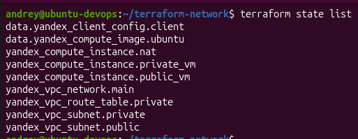
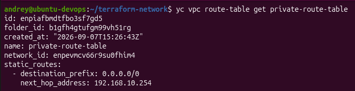
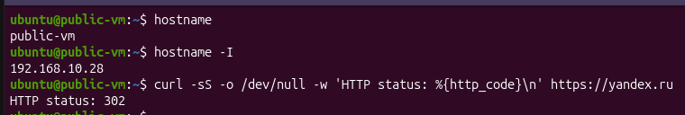
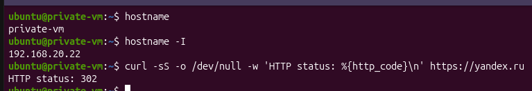

# Домашнее задание к занятию «Организация сети» - Сунцов Андрей

## Задание 1. Yandex Cloud

Инфраструктура создана с помощью Terraform.

### Созданные ресурсы

    terraform state list

### Таблица маршрутизации

    yc vpc route-table get private-route-table

### Проверка публичной VM

Публичная VM имеет доступ в интернет.

### Проверка приватной VM

Приватная VM не имеет публичного IP и получает доступ в интернет через NAT-инстанс.

Terraform-конфигурация находится в файлах `.tf` данного репозитория.
